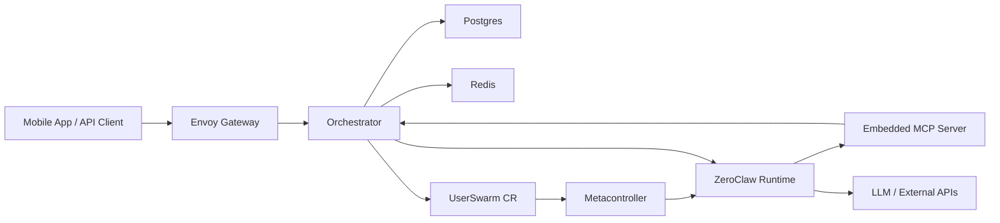

<div align="center">

# 🧠 Crawbl

"**Control plane for Crawbl AI**"

[](https://github.com/Crawbl-AI/crawbl-backend/actions/workflows/deploy-dev.yml)
[](https://go.dev)
[]()
[]()

</div>

---

- 🔐 **Auth & API** — authenticates users and serves the mobile app
- 💬 **Chat routing** — delivers messages between you and your AI agent
- 🔌 **Integrations** — connects Gmail, Slack, Calendar so the agent can act on your behalf
- 🧠 **Agent management** — spins up a private AI agent for each user, configures its tools and personality
- ☸️ **Infrastructure** — provisions and manages everything on Kubernetes via Pulumi + ArgoCD

> 📚 **Full docs:** [crawbl-docs](https://github.com/Crawbl-AI/crawbl-docs) · API reference, architecture, runbooks

## 🏗️ Architecture



> ⚠️ Simplified view. For detailed architecture, data flows, and system diagrams see [crawbl-docs](https://dev.docs.crawbl.com/core-concepts/architecture/system-overview).

## 🚀 Quick Start

```bash
# 1. Build the repo-local CLI, install hooks, and check your machine:
make setup

# 2. Source environment and start the stack:
# NOTE: All crawbl CLI commands requiring environment variables (from .env)
# should be run with: set -a && source .env && set +a <command>
set -a && source .env && set +a
./crawbl dev start

# 3. Verify:
curl http://localhost:7171/v1/health
```

💡 It builds `bin/crawbl` on first run and rebuilds it when CLI source changes, so you do not need a global install.

## 🛠️ CLI

Everything is managed through the `./crawbl` launcher or the thin root `Makefile`.

```
./crawbl setup                  # Check tools + create .env
./crawbl dev start              # Start the full local stack
./crawbl app build <component>              # Build a container image (tag auto-calculated)
./crawbl app deploy <component>             # Build, push, update ArgoCD (tag auto-calculated)
./crawbl app deploy <component> --tag v1.0.0  # Override with an explicit tag
./crawbl --help                 # Check other commands
```

## ✅ Local Checks

This repo ships a versioned `pre-push` hook in `.githooks/pre-push`.

- `make setup` installs the hook automatically
- `make post-clone` runs the one-time post-clone bootstrap (or re-runs it with `--force`)
- `make hooks` re-installs it if your Git config was reset
- the hook runs `make ci-check`
- `make ci-check` runs unit tests plus local and linux/amd64 `crawbl` builds to catch the same local-safe failures CI would catch later

The hook does not run the live E2E suite because that depends on the shared dev cluster and takes longer than a normal push gate should. Lint stays available as an explicit manual check with `./crawbl dev lint`.

## 📦 Components

| | Component | What it does |
|---|-----------|-------------|
| 🌐 | **Orchestrator** | Mobile-facing HTTP API + MCP server |
| 🔄 | **Webhook** | Builds and manages per-user AI agent pods |
| 🔐 | **Auth Filter** | Verifies user identity before requests reach the API |
| 🧹 | **Reaper** | Cleans up stale test users + orphaned agent pods |
| 🏗️ | **Infra** | Pulumi IaC for DOKS cluster + ArgoCD |

## 🗂️ Structure

```
cmd/crawbl/                     # Main binary: CLI + servers
cmd/envoy-auth-filter/          # Auth filter for Envoy Gateway
internal/
├── orchestrator/               # 🌐 API domain
│   ├── mcp/                    #    MCP server (agent ↔ orchestrator tools)
│   ├── integration/            #    OAuth connections (Gmail, Slack, etc.)
│   ├── server/                 #    HTTP handlers + Socket.IO realtime
│   ├── service/                #    Business logic layer
│   └── repo/                   #    Data access (Postgres)
├── userswarm/                  # 🔄 Agent pod lifecycle
│   ├── client/                 #    Creates and manages agent pods on K8s
│   ├── webhook/                #    Builds pod specs when agents are provisioned
│   └── reaper/                 #    Cleans up stale users + orphaned pods
├── zeroclaw/                   # 🧠 Agent runtime config + tool catalog
├── pkg/                        # 📦 Shared packages
│   ├── configenv/              #    Environment variable loading
│   ├── database/               #    Postgres connection + migrations
│   ├── errors/                 #    Typed error codes
│   ├── fileutil/               #    File + TOML helpers
│   ├── firebase/               #    FCM push notifications
│   ├── hmac/                   #    HMAC token signing + validation
│   ├── httpserver/             #    HTTP middleware + auth
│   ├── kube/                   #    Kubernetes helpers
│   ├── realtime/               #    Socket.IO + Redis pub/sub
│   ├── redisclient/            #    Redis connection
│   ├── runtime/                #    Graceful shutdown helpers
│   └── yamlvalues/             #    YAML file patching
└── infra/                      # 🏗️ Pulumi IaC
config/                         # 📋 Config reference + samples
migrations/                     # 📊 Postgres schema migrations
api/                            # 📐 Kubernetes CRD types
```

## ⚙️ Configuration

See [`config/README.md`](config/README.md) for the complete reference of every env var and hardcoded default.

## 🐳 Manual ZeroClaw Build

CI is slow — use this to build and push the ZeroClaw image directly.

```bash
# From crawbl-zeroclaw/ — build only:
crawbl app build zeroclaw --tag <tag>

# Build, push, and update ArgoCD in one step:
crawbl app deploy zeroclaw --tag <tag>
```

> If you build manually without deploy, update the image tag in `crawbl-argocd-apps` yourself — `deploy` does this automatically.

## 🚢 Deploy

`crawbl app deploy <component>` is the full local-first deploy workflow. Each call:

1. Verifies working tree is clean and pushed (backend components only; docs/website/zeroclaw skip this)
2. Builds the Docker image locally
3. Pushes to DOCR (`registry.digitalocean.com/crawbl/`)
4. Updates image tag in `crawbl-argocd-apps` and pushes
5. Creates a Git tag (auto-calculated from conventional commits)
6. Creates a GitHub release with Claude-enriched notes and a full changelog link

Tag is auto-calculated from conventional commits (`feat:` → minor bump, `!:` → major bump, default → patch). If a tag already exists on remote, patch is bumped until a free tag is found. Override with `--tag` if needed. `crawbl setup` verifies required tools: `docker`, `yq`, `gh`, `claude`.

```bash
crawbl app deploy <component>             # Build, push, update ArgoCD, tag, release
crawbl app deploy all                     # Deploy platform + auth-filter only
crawbl app deploy docs                    # Deploy docs (no git guard)
crawbl app deploy website                 # Deploy website (no git guard)
crawbl app deploy zeroclaw               # Deploy zeroclaw (no git guard)
crawbl app deploy <component> --tag v1.0.0  # Override with an explicit tag
```

For zeroclaw, tags use the fork convention `v<upstream>-crawbl.<N>` and auto-increment.

Makefile shortcuts (auto-semver, no manual tag needed):

```bash
make deploy-dev          # Deploy platform + auth-filter
make deploy-platform     # Deploy platform only
make deploy-zeroclaw     # Deploy zeroclaw only
make deploy-docs         # Deploy docs only
make deploy-website      # Deploy website only
```

## 📊 Observability

| Service | URL | Purpose |
|---------|-----|---------|
| VictoriaMetrics | [dev.metrics.crawbl.com](https://dev.metrics.crawbl.com) | Metrics storage + Prometheus-compatible query API |
| VictoriaLogs | [dev.logs.crawbl.com](https://dev.logs.crawbl.com) | Log storage + query UI |
| Fluent Bit | cluster-internal | Collects all container logs from every namespace, ships to VictoriaLogs |

## 🔗 Related

| | Repo | |
|---|------|---|
| 📚 | [crawbl-docs](https://github.com/Crawbl-AI/crawbl-docs) | Docs, API reference, architecture |
| 🤖 | [crawbl-zeroclaw](https://github.com/Crawbl-AI/crawbl-zeroclaw) | ZeroClaw agent runtime |
| 📱 | [crawbl-mobile](https://github.com/Crawbl-AI/crawbl-mobile) | Flutter mobile app |
| ☸️ | [crawbl-argocd-apps](https://github.com/Crawbl-AI/crawbl-argocd-apps) | K8s manifests + Helm values |
