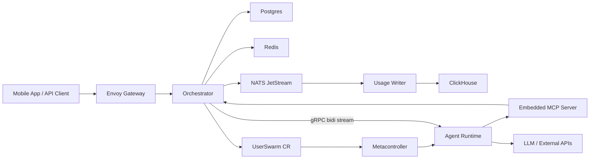

<div align="center">

# 🧠 Crawbl

"**Control plane for Crawbl AI**"

[](https://github.com/Crawbl-AI/crawbl-backend/actions/workflows/deploy-dev.yml)
[](https://go.dev)
[]()
[]()

</div>

---

- 🔐 **Auth & API** — authenticates users and serves the mobile app
- 💬 **Chat routing** — delivers messages between you and your AI agent
- 🔌 **Integrations** — connects Gmail, Slack, Calendar so the agent can act on your behalf
- 🧠 **Agent management** — spins up a private AI agent for each user, configures its tools and personality
- ☸️ **Infrastructure** — provisions and manages everything on Kubernetes via Pulumi + ArgoCD

> 📚 **Full docs:** [crawbl-docs](https://github.com/Crawbl-AI/crawbl-docs) · API reference, architecture, runbooks

## 🏗️ Architecture



> ⚠️ Simplified view. For detailed architecture, data flows, and system diagrams see [crawbl-docs](https://dev.docs.crawbl.com/core-concepts/architecture/system-overview).

## 🚀 Quick Start

```bash
# 1. Build the repo-local CLI, install hooks, and check your machine:
./crawbl setup

# 2. Source environment:
# NOTE: All crawbl CLI commands requiring environment variables (from .env)
# should be run with: set -a && source .env && set +a <command>
set -a && source .env && set +a

# 3. Deploy to dev:
crawbl app deploy platform
```

💡 It builds `bin/crawbl` on first run and rebuilds it when CLI source changes, so you do not need a global install.

## 🛠️ CLI

Everything is managed through the `./crawbl` CLI.

```
./crawbl setup                              # Check tools, install hooks, create .env
./crawbl app build <component>              # Build a container image (ko or Docker)
./crawbl app deploy <component>             # Build, push, update ArgoCD (tag auto-calculated)
./crawbl app deploy <component> --tag v1.0.0  # Override with an explicit tag
./crawbl generate                           # Regenerate protobuf/gRPC code
./crawbl ci check                           # Run full CI pipeline (generate + verify + cross-compile)
./crawbl --help                             # Check other commands
```

## ✅ Local Checks

This repo ships a versioned `pre-push` hook in `.githooks/pre-push`.

- `./crawbl setup` installs the hook automatically
- `./scripts/post-clone.sh` runs the one-time post-clone bootstrap (or re-runs it with `--force`)
- the hook runs `./crawbl ci check`
- `crawbl ci check` runs protobuf codegen, formatting, linting, tests, and a linux/amd64 cross-compile to catch the same local-safe failures CI would catch later

The hook does not run the live E2E suite because that depends on the shared dev cluster and takes longer than a normal push gate should. Lint stays available as an explicit manual check with `./crawbl dev lint`.

## 📦 Components

| | Component | What it does |
|---|-----------|-------------|
| 🌐 | **Orchestrator** | Mobile-facing HTTP API + MCP server |
| 🤖 | **Agent Runtime** | Per-workspace AI agent pod (gRPC on port 42618) |
| 🔄 | **Webhook** | Builds and manages per-user AI agent pods |
| 🔐 | **Auth Filter** | Verifies user identity before requests reach the API |
| 🧹 | **Reaper** | Cleans up stale test users + orphaned agent pods |
| 🏗️ | **Infra** | Pulumi IaC for DOKS cluster + ArgoCD |

## 🗂️ Structure

```
cmd/
├── crawbl/                     # Main binary: CLI + servers
├── crawbl-agent-runtime/       # Per-workspace agent runtime binary
└── envoy-auth-filter/          # Auth filter for Envoy Gateway (WASM)

proto/agentruntime/v1/          # gRPC proto definitions

internal/
├── orchestrator/               # 🌐 API domain
│   ├── server/                 #    HTTP handlers, Socket.IO, MCP endpoint
│   │   ├── handler/            #      Route handlers
│   │   ├── dto/                #      Request/response types
│   │   ├── socketio/           #      Socket.IO broadcaster
│   │   └── mcp/                #      Embedded MCP server
│   ├── service/                #    Business logic layer
│   │   ├── chatservice/        #      Message sending + gRPC streaming
│   │   ├── usagepublisher/     #      NATS usage event publishing
│   │   └── mcpservice/         #      MCP tool handlers
│   ├── repo/                   #    Data access (Postgres)
│   │   └── usagerepo/          #      Usage counters + quota queries
│   └── integration/            #    OAuth connections (Gmail, Slack, etc.)
├── userswarm/                  # 🔄 Agent pod lifecycle
│   ├── client/                 #    gRPC client to runtime pods
│   ├── webhook/                #    Builds pod specs when agents are provisioned
│   └── reaper/                 #    Cleans up stale users + orphaned pods
├── agentruntime/               # 🤖 Agent runtime (deployed per-workspace)
│   ├── server/                 #    gRPC Converse + Memory handlers
│   ├── runner/                 #    ADK-Go agent runner
│   ├── session/                #    Redis-backed session state
│   ├── storage/                #    DO Spaces file storage
│   └── memory/                 #    Postgres-backed durable memory
├── pkg/                        # 📦 Shared packages
│   ├── crawblnats/             #    NATS JetStream client
│   ├── database/               #    Postgres connection + migrations
│   ├── errors/                 #    Typed error codes
│   ├── grpc/                   #    gRPC HMAC auth interceptors
│   ├── hmac/                   #    HMAC token signing + validation
│   ├── httpserver/             #    HTTP middleware + auth
│   ├── pricing/                #    In-memory model pricing cache
│   ├── realtime/               #    Socket.IO event types + broadcasting
│   └── ...                     #    firebase, kube, redis, telemetry, etc.
└── infra/                      # 🏗️ Pulumi IaC

migrations/
├── orchestrator/               # 📊 Postgres schema (6 migrations + seed data)
└── clickhouse/                 # 📊 ClickHouse analytics DDL
api/                            # 📐 Kubernetes CRD types
```

## ⚙️ Configuration

See [`config/README.md`](config/README.md) for the complete reference of every env var and hardcoded default.

## 🚢 Deploy

`crawbl app deploy <component>` is the full local-first deploy workflow. Each call:

1. Verifies working tree is clean and pushed (backend components only; docs/website/agent-runtime skip this)
2. Builds the Docker image locally
3. Pushes to DOCR (`registry.digitalocean.com/crawbl/`)
4. Updates image tag in `crawbl-argocd-apps` and pushes
5. Creates a Git tag (auto-calculated from conventional commits)
6. Creates a GitHub release with auto-generated notes and a full changelog link

Tag is auto-calculated from conventional commits (`feat:` → minor bump, `!:` → major bump, default → patch). If a tag already exists on remote, patch is bumped until a free tag is found. Override with `--tag` if needed. `crawbl setup` verifies required tools: `docker`, `yq`, `gh`.

```bash
crawbl app deploy platform                 # Deploy platform (orchestrator + webhook + reaper)
crawbl app deploy auth-filter               # Deploy Envoy WASM auth filter
crawbl app deploy agent-runtime             # Deploy agent-runtime (no git guard)
crawbl app deploy docs                      # Deploy docs (no git guard)
crawbl app deploy website                   # Deploy website (no git guard)
crawbl app deploy <component> --tag v1.0.0  # Override with an explicit tag
```

> 💡 **Migrations are automatic.** The orchestrator runs pending database migrations on startup — no separate migration step needed after deploy.

For agent-runtime and auth-filter, tags use the fork convention `v<upstream>-crawbl.<N>` and auto-increment.

## 📊 Observability

The full monitoring stack (VictoriaMetrics, VictoriaLogs, Fluent Bit) is **prod-only** and is not deployed in the dev environment.

| Service | Environment | Purpose |
|---------|-------------|---------|
| VictoriaMetrics | Prod only | Metrics storage + Prometheus-compatible query API |
| VictoriaLogs | Prod only | Log storage + query UI |
| Fluent Bit | Prod only | Collects all container logs, ships to VictoriaLogs |
| ClickHouse | cluster-internal | LLM usage analytics (token counts, costs) |
| NATS JetStream | cluster-internal | Usage event streaming (orchestrator → ClickHouse) |

In dev, use `kubectl logs` for container output and `kubectl top` for resource usage.

## 🔗 Related

| | Repo | |
|---|------|---|
| 📚 | [crawbl-docs](https://github.com/Crawbl-AI/crawbl-docs) | Docs, API reference, architecture |
| 🤖 | Agent Runtime | Per-workspace agent service (in-tree: `cmd/crawbl-agent-runtime/`) |
| 📱 | [crawbl-mobile](https://github.com/Crawbl-AI/crawbl-mobile) | Flutter mobile app |
| 🌐 | [crawbl-website](https://github.com/Crawbl-AI/crawbl-website) | Next.js marketing site at crawbl.com |
| ☸️ | [crawbl-argocd-apps](https://github.com/Crawbl-AI/crawbl-argocd-apps) | K8s manifests + Helm values |
