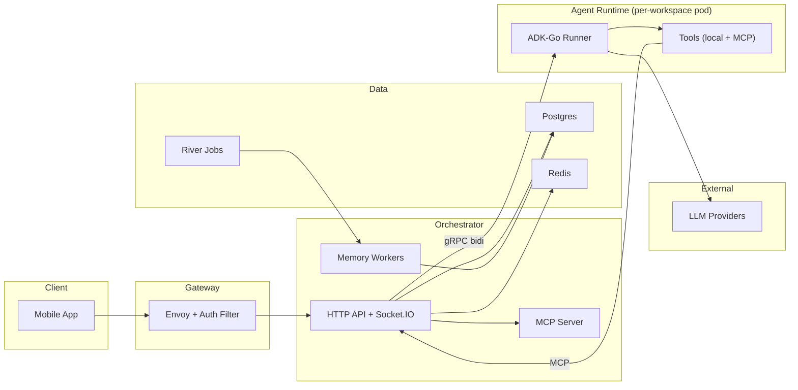

<div align="center">

# Crawbl Backend

Control plane for [Crawbl AI](https://crawbl.com) — auth, chat routing, agent management, integrations, and infrastructure.

[](https://github.com/Crawbl-AI/crawbl-backend/actions/workflows/deploy-dev.yml)
[](https://sonar-dev.crawbl.com/dashboard?id=crawbl-backend)
[](https://go.dev)
[]()

</div>

---

- 🔐 **Auth & API** — authenticates users and serves the mobile app
- 💬 **Chat routing** — delivers messages between you and your AI agents via gRPC streaming
- 🔌 **Integrations** — connects Gmail, Slack, Calendar so agents can act on your behalf
- 🧠 **Agent management** — spins up a private AI agent swarm per workspace, configures tools and personality
- 🧬 **Memory** — durable agent memory with auto-ingest, layered recall, and background processing
- ☸️ **Infrastructure** — provisions and manages everything on Kubernetes via Pulumi + ArgoCD

> 📚 **Full docs:** [crawbl-docs](https://github.com/Crawbl-AI/crawbl-docs) · API reference, architecture, runbooks

## Architecture



> Simplified view. Full architecture at [crawbl-docs](https://dev.docs.crawbl.com/core-concepts/architecture/system-overview).

## Quick Start

```bash
./crawbl setup                    # install tools, hooks, check env
set -a && source .env && set +a   # load credentials
crawbl app deploy platform        # build + deploy to dev cluster
```

## CLI

```
crawbl setup                           # check tools, install hooks, create .env
crawbl app build <component>           # build container image
crawbl app deploy <component>          # build, push, update ArgoCD tag
crawbl app deploy <component> --tag v1 # explicit tag override
crawbl generate                        # regenerate protobuf/gRPC
crawbl ci check                        # full CI: generate + lint + test + cross-compile
crawbl test e2e                        # run E2E suite against live cluster
crawbl dev lint                        # lint only
crawbl --help                          # all commands
```

## Components

| Component         | Description                                         |
| ----------------- | --------------------------------------------------- |
| **Orchestrator**  | HTTP API, Socket.IO, MCP server, memory workers     |
| **Agent Runtime** | Per-workspace AI agent pod (ADK-Go, gRPC on :42618) |
| **Webhook**       | Builds pod specs for per-user agent provisioning    |
| **Auth Filter**   | Envoy WASM filter for request authentication        |
| **Reaper**        | Cleans up stale test users + orphaned pods          |
| **Infra**         | Pulumi IaC for DOKS cluster + ArgoCD bootstrap      |

## Structure

```
cmd/
  crawbl/                          # CLI + platform servers
  crawbl-agent-runtime/            # per-workspace agent binary
  envoy-auth-filter/               # Envoy WASM auth filter

internal/
  orchestrator/
    server/                        # HTTP handlers, Socket.IO, MCP
      handler/   dto/   socketio/
      mcp/       mcpserver/
    service/                       # business logic
      chatservice/     authservice/      workspaceservice/
      integrationservice/  mcpservice/   agentservice/
      workflowservice/     auditservice/
    repo/                          # Postgres data access (20 repos)
    memory/                        # durable memory: autoingest, layers, jobs
    queue/                         # River job queue workers
    integration/                   # OAuth adapters (Gmail, Slack, Calendar)
  agentruntime/
    server/                        # gRPC Converse + Memory handlers
    runner/                        # ADK-Go agent graph (Manager -> Wally, Eve)
    agents/                        # agent constructors + defaults
    tools/                         # local tools + MCP client
    session/                       # Redis-backed session state
    storage/                       # DO Spaces file storage
  userswarm/
    client/                        # gRPC client to runtime pods
    webhook/                       # pod spec builder
    reaper/                        # stale user + pod cleanup
  pkg/                             # shared: database, errors, grpc, hmac,
                                   # httpserver, river, realtime, pricing, ...

proto/agentruntime/v1/             # gRPC proto definitions
migrations/orchestrator/           # Postgres schema (auto-applied on startup)
migrations/clickhouse/             # ClickHouse analytics DDL
config/                            # env var reference + Helm values
api/                               # Kubernetes CRD types
```

## Related Repos

| Repo                                                                  | Purpose                           |
| --------------------------------------------------------------------- | --------------------------------- |
| [crawbl-docs](https://github.com/Crawbl-AI/crawbl-docs)               | Docs, API reference, architecture |
| [crawbl-argocd-apps](https://github.com/Crawbl-AI/crawbl-argocd-apps) | K8s manifests + Helm values       |
| [crawbl-mobile](https://github.com/Crawbl-AI/crawbl-mobile)           | Flutter mobile app                |
| [crawbl-website](https://github.com/Crawbl-AI/crawbl-website)         | Next.js marketing site            |
